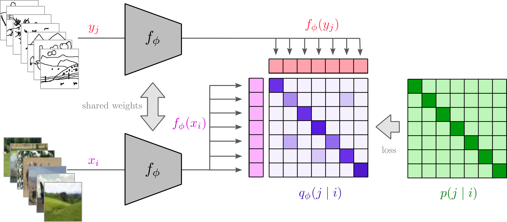

<h1 align="center">
Sketch Scape
</h1>

<h5 align="center">

[](http://arxiv.org/abs/2509.06566)
[](https://bmvc2025.bmva.org/)
[](https://www.python.org/)
[](https://pytorch.org/)
[](https://www.gnu.org/licenses/gpl-3.0.en.html)
</h5>

<p align="center">
Official implementation of 
<a href="http://arxiv.org/abs/2509.06566">Back To The Drawing Board: Rethinking Scene-Level Sketch-Based Image Retrieval</a>, BMVC2025 :fire:.
A simple and effective scene-level sketch-based image retrieval (SBIR) model achieving state of the art results.
</p>

## :bar_chart: Main Results

Comparison of results on the FS-COCO dataset.

| Method               | R@1 (Normal) | R@5 (Normal) | R@10 (Normal) | R@1 (Unseen) | R@5 (Unseen) | R@10 (Unseen) |
|----------------------|--------------|--------------|---------------|--------------|--------------|---------------|
| Siam-VGG             | 23.3         | -            | 52.6          | 10.6         | -            | 32.5          |
| HOLEF-VGG            | 22.8         | -            | 53.1          | 10.9         | -            | 33.1          |
| SceneTrilogy         | 24.1         | -            | 53.9          | -            | -            | -             |
| SceneDiff (w Sketch) | 25.2         | 45.9         | 55.9          | -            | -            | -             |
| FreestyleRet         | 29.6         | -            | 56.1          | -            | -            | -             |
| **Ours**             | **61.9**     | **81.4**     | **87.2**      | **60.0**     | **80.2**     | **86.1**      |

## :microscope: Methodology

|          Overview of the proposed method          |
|:-------------------------------------------------:|
|      |

Our encoder model is trained in a Siamese
manner, accepting both images and sketches. During training, the embeddings are matched
on a batch level, aligning the similarity matrix with a target one, using an ICon based loss function.
In the inference stage, the encoder is simply generating embeddings that are then compared using cosine distance.

## Replicating the results

### :file_folder: FSCOCO dataset

You can download the dataset from the official [FS-COCO website](https://fscoco.github.io). Extract the dataset into the
project folder.

### Pretrained models

You can download the pretrained model for both train/test splits of FS-COCO:

- [Normal split](https://www.dropbox.com/scl/fi/6s7dhekt4ikihuoptobhy/fscoco_normal.pth?rlkey=7jklykr8zq9ioxx31q2gdbeqx&dl=1)
- [Unseen split](https://www.dropbox.com/scl/fi/9fv399bupkandn6ouj41g/fscoco_unseen.pth?rlkey=pk3t5t2winuejff8p0e7mxap6&dl=1)

Place the downloaded model files in the models folder.

### :open_file_folder: Example folder structure:

```
    SketchScape
    ├── models
    │   ├── model_normal.pth
    │   ├── model_unseen.pth
    │   └── ...
    ├── fscoco
    │   ├── raster_sketches
    │   ├── images
    │   └── ...
    ├── train.py
    ├── eval.py
    ...
```

### :wrench: Installation

To install required libraries run:

```
pip install -r requirements.txt
```

The default installation includes the cpu version of torch. To use CUDA, replace it with the appropriate torch version.
Tested on *python3.10* .

TODO

### Running the code

You can train the model using *train.py* and evaluate the trained models using *eval.py*.

### Available eval command line arguments

| Argument       | Description                                          | Default  |
|----------------|------------------------------------------------------|----------|
| `--no_cuda`    | Disables CUDA.                                       | `False`  |
| `--save`       | Save generated embeddings for sketches and images.   | `False`  |
| `--visualize`  | Generate an HTML file with visualization of results. | `True`   |
| `--val_unseen` | Use unseen user train/val split.                     | `False`  |
| `--batch_size` | Number of samples in each batch.                     | `60`     |
| `--seed`       | Seed for reproducibility.                            | `42`     |
| `--data_dir`   | Directory for the dataset.                           | `fscoco` |
| `--models`     | Paths to the model files.                            | `''`     |

### :clipboard: Running the evaluation

To replicate results on the FS-COCO dataset from the paper, run the code with the following arguments.

```
python3 eval.py --models models/model_normal.pth

python3 eval.py --unseen --models models/model_unseen.pth
```

On completion, you will find a *result.html* file inside the folder which contains the visualized results. \
When opened, it will display the 10 most similar images to the sketch according to model predictions. \
The correct image will have a red outline. If no image in a row has a red outline, the correct image was not among \
the first 10 most similar results.

### Available train command line arguments

| Argument       | Description                                                                               | Default              |
|----------------|-------------------------------------------------------------------------------------------|----------------------|
| `--no_cuda`    | Disables CUDA.                                                                            | `False`              |
| `--save`       | Path to save the trained model.                                                           | `model_XXX`          |
| `--val_unseen` | Use unseen user train/val split.                                                          | `False`              |
| `--epochs`     | Number of epochs to train.                                                                | `10`                 |
| `--lr`         | Initial learning rate.                                                                    | `0.0001`             |
| `--batch_size` | Number of samples in each batch.                                                          | `60`                 |
| `--model_path` | path to saved model to load or specifications of a model to load.                         | `CLIP;convnext_base` |
| `--seed`       | Seed for reproducibility.                                                                 | `42`                 |
| `--data_dir`   | Directory for the dataset.                                                                | `'fscoco'`           |
| `--loss`       | Loss function to use. Options: InfoNCE, ICon, Triplet. Add ; to separate loss parameters. | `'ICon'`             |


### :chart_with_upwards_trend: Training the model

Default vales of the parameters are set to match those used in the paper.
You can train a new model with different arguments with *train.py*
```
python3 train.py <options>
```

## :pencil2: Citing

If you find our paper and code useful, please consider giving a star :star: and citing:

```
@inproceedings{demic2025back,
  title={Back To The Drawing Board: Rethinking Scene-Level Sketch-Based Image Retrieval},
  author={Demić, Emil and Čehovin Zajc, Luka},
  booktitle={British Machine Vision Conference (BMVC2025)},
  year={2025}
}
```

## :+1: Acknowledgments

This research was in part supported by ARIS (Slovenian Research Agency) research programme Computer Vision (P2-0214).


